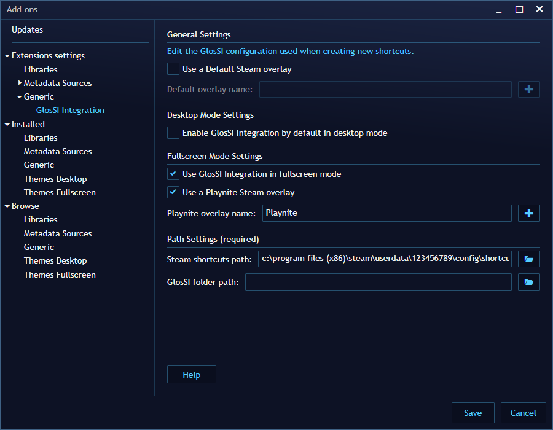
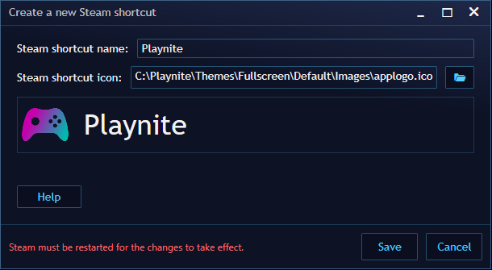
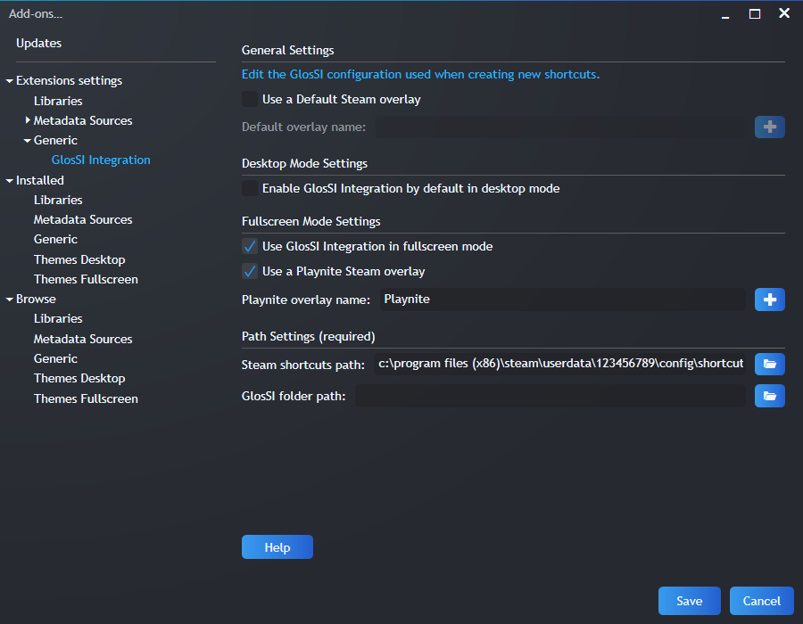
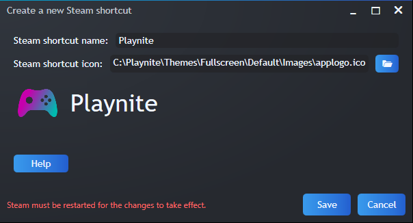

# [GlosSI](https://glossi.flatspot.pictures/) Integration Extension for [Playnite](https://playnite.link/)
This extension automates creating, removing, launching and closing of GlosSI Steam shortcuts for your games in Playnite.

## Why would I want to use this extension?
This extension uses GlosSI. GlosSI lets you use **Steam input** and/or the **Steam overlay** with any game!
- GlosSI runs as a transparent always-on-top window, meaning that GlosSI will work with practically any game.
- Steam input is useful for per-game controller configuration and for using various controllers: Steam supports, among other controllers, PlayStation, Xbox, generic XInput, DirectInput and Steam controllers.

Apart from all the features that GlosSI offers on its own, this extension makes it easy to use the Steam overlay and Steam input for any game in your Playnite library. Each game can automatically be assigned a separate Steam overlay, allowing for unique controller configurations and making it easier for your Steam friends to see what game you are currently playing. The Steam overlay can be launched automatically when you launch your games. Additionally, when in fullscreen mode a Steam overlay can be assigned to Playnite itself, making it possible to take advantage of Steam input while navigating your Playnite library.

## More information
Check out the [wiki](https://github.com/LemmusLemmus/GlosSI-Integration-Playnite/wiki) for information about getting started and general usage of the extension!

## Acknowledgements
This extension would not have been possible without JosefNemec and Alia5's amazing work on Playnite and GlosSI respectively! Code from Thomas Pircher and darklinkpower's various extensions was also extremely useful!

## Screenshots
Some screenshots of the add-on settings menus, using the default Playnite theme and darklinkpower's Helium theme, fittingly inspired by Steam.
### Default Theme
Extension settings menu: 

  Overlay creation menu: 

### Helium Theme
Extension settings menu: 

  Overlay creation menu: 

